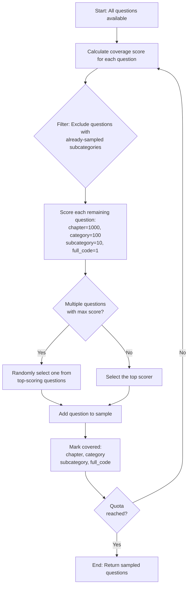

# MedConceptsQA Max-Coverage Sampling Script

## Overview

`sample_medconceptsqa.py` performs **maximum-coverage hierarchical sampling** 
of the MedConceptsQA dataset. 
What this means is that the sampling is done in a hierarchy-stratified manner
where the sampler tries to optimize for the maximum coverage across all levels
of the ICD-9 or ICD-10 hierarchy for any sample size that the user passes in.

### Key Features

- **Greedy Coverage Algorithm**: Prioritizes covering unique codes at all hierarchy levels
- **No Duplicate Subcategories**: Ensures maximum diversity by never sampling the same subcategory twice
- **Hierarchy-Aware**: Optimizes coverage across chapters → categories → subcategories → full codes
- **Single Vocabulary Focus**: Sample from either ICD-9-CM or ICD-10-CM (default: ICD-10-CM)
- **Enriched Output**: Adds human-readable descriptions for each hierarchy level
- **Reproducible**: Seed-based sampling for identical results

## Quick Start

This replicates the current dataset hosted on HuggingFace.
```bash
# Sample 15,000 questions from ICD-10-CM
uv run python sample_medconceptsqa.py \
  --size-quota 15000 \
  --vocab ICD10CM \
  --output-name medconceptsqa_15k \
  --seed 42
```

This creates:
- `medconceptsqa_15k/` - HuggingFace DatasetDict with 3 splits (easy/medium/hard)
- `medconceptsqa_15k_plan.json` - Detailed sampling plan with coverage statistics
- `medconceptsqa_15k_report.txt` - Human-readable coverage report

all under a folder titled `medconceptsqa-sample_medconceptsqa_15k` that enables
easy upload to huggingface_hub.

## Command-Line Arguments

### Required Arguments

**`--size-quota INT`**
- Total number of samples to generate across all difficulties
- Distributed equally by default (e.g., 15,000 → 5,000 easy, 5,000 medium, 5,000 hard)
- Example: `--size-quota 15000` creates 15,000 total samples

### Optional Arguments

**`--vocab {ICD9CM,ICD10CM}`**
- Which vocabulary to sample from
- **Default: ICD10CM** (recommended - most current coding system)
- **ICD10CM**: Modern, detailed hierarchy
  - 26 chapters, 1,914 categories, 46,380 subcategories, 95,513 full codes
  - Used in current medical coding (post-2015)
- **ICD9CM**: Legacy coding system
  - 1,041 categories, 6,406 subcategories, 17,552 full codes
  - Used for historical/public health research

**`--difficulty-split-strategy {equal,proportional}`**
- How to distribute the size quota across easy/medium/hard difficulties
- **Default: equal** (recommended for balanced datasets)
  - Splits quota evenly: 15,000 → 5,000 each
- **proportional**: Splits based on original dataset proportions
  - ICD10: ~36% easy, 31% medium, 33% hard
  - Example: 15,000 → 5,400 easy, 4,650 medium, 4,950 hard

**`--output-name STR`**
- Name for output files (default: `medconceptsqa_sample`)
- Creates: `{output_name}/`, `{output_name}_plan.json`, `{output_name}_report.txt`

**`--seed INT`**
- Random seed for reproducibility (default: 42)
- Use the same seed to generate identical samples

**`--log-level {DEBUG,INFO,WARNING,ERROR,QUIET}`**
- Logging verbosity (default: INFO)
- **DEBUG**: Show detailed diagnostic information
- **INFO**: Standard progress updates with coverage statistics
- **WARNING**: Only show warnings and errors
- **ERROR**: Only show errors
- **QUIET**: Minimal output (only final summary)

**`--plan-only`**
- Generate sampling plan JSON without creating the dataset
- Useful for reviewing coverage statistics before execution
- Creates only `{output_name}_plan.json`

## How the Greedy Max-Coverage Algorithm Works

The script uses a greedy algorithm to maximize unique code coverage across the hierarchy. 
Here's a detailed walkthrough:

### Algorithm Overview



### Step-by-Step Example

Let's walk through sampling with a quota of 15,000 from ICD-10-CM:

**1. Quota Distribution** (Equal strategy)
```
Total quota: 15,000
├── Easy: 5,000
├── Medium: 5,000
└── Hard: 5,000
```

**2. First Iteration (Easy difficulty)**

Available questions pool: 94,576 questions

The algorithm examines each question and calculates a **coverage score**:

| Question | Code | Chapter | Category | Subcategory | Full Code | Score Calculation |
|----------|------|---------|----------|-------------|-----------|-------------------|
| Q1 | S02.0XXA | S | S02 | S02.0 | S02.0XXA | 1000+100+10+1 = **1111** |
| Q2 | S02.1XXA | S | S02 | S02.1 | S02.1XXA | 0+0+10+1 = **11** (S and S02 already covered) |
| Q3 | I10 | I | I10 | None | I10 | 1000+100+0+1 = **1101** |

**Selection**: Q1 is selected (highest score: 1111)
- **Covered after iteration 1**: 1 chapter (S), 1 category (S02), 1 subcategory (S02.0), 1 full code

**3. Second Iteration**

| Question | Code | Chapter | Category | Subcategory | Full Code | Score |
|----------|------|---------|----------|-------------|-----------|-------|
| Q2 | S02.1XXA | S | S02 | S02.1 | S02.1XXA | 0+0+10+1 = **11** |
| Q3 | I10 | I | I10 | None | I10 | 1000+100+0+1 = **1101** |
| Q4 | M79.3 | M | M79 | M79.3 | M79.3 | 1000+100+10+1 = **1111** |

**Selection**: Q4 is selected (score 1111, new chapter)
- **Covered after iteration 2**: 2 chapters, 2 categories, 2 subcategories, 2 full codes

**4. Continue Until Quota Reached...**

After 5,000 iterations for "easy":
- **All 26 chapters covered** (100%)
- **Typically ~5,000 categories covered** (depending on quota and hierarchy distribution)
- **Exactly 5,000 unique subcategories covered** (no duplicates!)
- **5,000 unique full codes**

### Coverage Progression

As sampling progresses, the algorithm naturally prioritizes:

1. **Phase 1 (Early)**: Covers all chapters quickly (first ~26 samples)
2. **Phase 2 (Middle)**: Covers many categories (first ~1,000-2,000 samples)
3. **Phase 3 (Late)**: Maximizes subcategory coverage (remaining quota)

```
Samples    Chapters  Categories  Subcategories  Full Codes
     100         26         100            100         100
   1,000         26       1,000          1,000       1,000
   5,000         26       ~4,500          5,000       5,000
  10,000         26       ~9,000         10,000      10,000
```
## Usage Examples

### Example 1: Recommended Configuration for RL Training

```bash
uv run python sample_medconceptsqa.py \
  --size-quota 15000 \
  --vocab ICD10CM \
  --difficulty-split-strategy equal \
  --output-name rl_training_15k \
  --seed 42
```

**Result:**
- 15,000 total samples (5,000 per difficulty)
- Maximum subcategory diversity
- All 26 chapters covered
- ~25% of all subcategories covered

### Example 2: Small Sample for Testing

```bash
uv run python sample_medconceptsqa.py \
  --size-quota 300 \
  --vocab ICD10CM \
  --output-name test_300 \
  --seed 42
```

**Result:** 300 samples (100 per difficulty)

### Example 3: ICD-9-CM Legacy Dataset

```bash
uv run python sample_medconceptsqa.py \
  --size-quota 6000 \
  --vocab ICD9CM \
  --output-name icd9_legacy_6k \
  --seed 42
```

**Result:**
- 6,000 samples from ICD-9-CM
- Higher coverage percentage due to smaller hierarchy

### Example 4: Proportional Difficulty Split

```bash
uv run python sample_medconceptsqa.py \
  --size-quota 12000 \
  --vocab ICD10CM \
  --difficulty-split-strategy proportional \
  --output-name proportional_12k \
  --seed 123
```

**Result:**
- ~4,320 easy, ~3,720 medium, ~3,960 hard
- Matches original MedConceptsQA difficulty distribution

### Example 5: Plan-Only Mode (Review Coverage First)

```bash
# Generate plan to see coverage statistics
uv run python sample_medconceptsqa.py \
  --size-quota 15000 \
  --vocab ICD10CM \
  --plan-only \
  --output-name my_sample

# Review the coverage statistics
cat my_sample_plan.json

# If satisfied, run again without --plan-only
uv run python sample_medconceptsqa.py \
  --size-quota 15000 \
  --vocab ICD10CM \
  --output-name my_sample
```

### Example 6: Quiet Mode for Automation

```bash
uv run python sample_medconceptsqa.py \
  --size-quota 10000 \
  --log-level QUIET \
  --output-name automated_10k
```

Only shows final summary, no progress bars.

## Output Files

### 1. Dataset Directory (`medconceptsqa-sample_{output_name}/{output_name}/`)

HuggingFace DatasetDict with 3 splits (per difficulty):

```python
from datasets import load_from_disk

dataset = load_from_disk("medconceptsqa_15k")
print(dataset)
# DatasetDict({
#     icd10cm_easy: Dataset({
#         features: ['question_id', 'question', 'answer', 'answer_id',
#                    'option1', 'option2', 'option3', 'option4',
#                    'vocab', 'level'],
#         num_rows: 5000
#     }),
#     icd10cm_medium: Dataset({...}),
#     icd10cm_hard: Dataset({...})
# })

# Access a specific example
example = dataset["icd10cm_easy"][0]
print(example["question"])
# "What is the description of the medical code S02.0XXA in ICD-10-CM?"

print(example["answer"])
# "Fracture of vault of skull, initial encounter for closed fracture"
```

### Dataset Columns

The sampled dataset contains the same columns as the original MedConceptsQA dataset:

| Column | Description | Example Value |
|--------|-------------|---------------|
| `question_id` | Unique identifier for the question | 12345 |
| `question` | The question text | "What is the description of the medical code S02.0XXA in ICD-10-CM?" |
| `answer` | The correct answer | "Fracture of vault of skull, initial encounter for closed fracture" |
| `answer_id` | Index of the correct answer (0-3) | 2 |
| `option1` | First answer option | "..." |
| `option2` | Second answer option | "..." |
| `option3` | Third answer option | "..." |
| `option4` | Fourth answer option | "..." |
| `vocab` | Vocabulary system | "ICD-10-CM" |
| `level` | Difficulty level | "easy" |

**Note:** The sampling algorithm uses ICD hierarchy codes internally (chapter, category, subcategory, full_code)
to maximize coverage, but these hierarchy columns are **not** included in the final dataset output.
Only the original MedConceptsQA columns are preserved.

### 2. Sampling Plan JSON (`{output_name}_plan.json`)

Complete record of sampling with coverage statistics:

```json
{
  "metadata": {
    "created_at": "2025-10-22T20:45:03",
    "vocab": "ICD10CM",
    "size_quota": 15000,
    "difficulty_strategy": "equal",
    "total_sampled": 15000,
    "seed": 42
  },
  "difficulty_quotas": {
    "easy": 5000,
    "medium": 5000,
    "hard": 5000
  },
  "total_available": {
    "chapters": 26,
    "categories": 1914,
    "subcategories": 46380,
    "full_codes": 95513
  },
  "sampling_results": {
    "easy": {
      "quota": 5000,
      "sampled_count": 5000,
      "coverage": {
        "chapters": 26,
        "categories": 1891,
        "subcategories": 5000,
        "full_codes": 5000
      },
      "question_ids": [...]
    },
    ...
  }
}
```

**Key Fields:**
- `total_available`: How many unique codes exist in the dataset
- `coverage`: How many unique codes were sampled
- Calculate coverage percentage: `(coverage / total_available) × 100`

### 3. Text Report (`{output_name}_report.txt`)

Human-readable summary:

```
================================================================================
MEDCONCEPTSQA MAX-COVERAGE SAMPLING REPORT
================================================================================

Generated: 2025-10-22T20:45:03
Runtime: 77.2 seconds

CONFIGURATION
--------------------------------------------------------------------------------
Vocabulary           : ICD10CM
Size Quota           : 15000
Difficulty Strategy  : equal
Total Sampled        : 15000
Random Seed          : 42

DIFFICULTY QUOTAS
--------------------------------------------------------------------------------
EASY     : 5,000 / 5,000 (100.0%)
MEDIUM   : 5,000 / 5,000 (100.0%)
HARD     : 5,000 / 5,000 (100.0%)

COVERAGE STATISTICS
================================================================================

Total samples: 15,000

ICD10CM:

  Available nodes in dataset:
    Chapters     : 26
    Categories   : 1914
    Subcategories: 46380
    Full codes   : 95513

  AGGREGATE (across all splits):
    Chapters     : 26 / 26 (100.0%)
    Categories   : 1914 / 1914 (100.0%)
    Subcategories: 15000 / 46380 (32.8%)
    Full codes   : 10122 / 95513 (10.6%)

  Coverage by difficulty:

  EASY:
    Chapters     : 26 / 26 (100.0%)
    Categories   : 1891 / 1914 (98.8%)
    Subcategories: 5000 / 46380 (10.8%)
    Full codes   : 5000 / 95513 (5.2%)

  MEDIUM:
    Chapters     : 25 / 26 (96.2%)
    Categories   : 1856 / 1914 (97.0%)
    Subcategories: 5000 / 46380 (10.8%)
    Full codes   : 5000 / 95513 (5.2%)

  HARD:
    Chapters     : 25 / 26 (96.2%)
    Categories   : 1872 / 1914 (97.8%)
    Subcategories: 5000 / 46380 (10.8%)
    Full codes   : 5000 / 95513 (5.2%)

================================================================================
```

## Understanding ICD Hierarchy

The ICD (International Classification of Diseases) organizes medical diagnoses hierarchically:

### ICD-10-CM Example: "Fracture of occiput"

```
Level           Code        Description
────────────────────────────────────────────────────────────────
Chapter         S           Injury, poisoning and certain other
                            consequences of external causes

Category        S02         Fracture of skull and facial bones

Subcategory     S02.0       Fracture of vault of skull

Full Code       S02.0XXA    Fracture of vault of skull, initial
                            encounter for closed fracture
```
**Not included:** Most granular laterality/anatomy (S02.0XXB, S02.0XXD, etc.)

### ICD-9-CM Example: "Fracture of tibia and fibula"

```
Level           Code        Description
────────────────────────────────────────────────────────────────
Chapter/        823         Fracture of tibia and fibula
Category

Subcategory     823.2       Fracture of shaft of tibia and fibula

Full Code       823.21      Fracture of shaft of tibia and fibula,
                            open
```

**Note:** ICD-9 has simpler structure (no separate chapter level)

## Citation

If you use this sampling script in your research, please cite MedConceptsQA:

```bibtex
@article{medconceptsqa2024,
  title={MedConceptsQA: Open Source Medical Concepts QA Benchmark},
  author={Pal, Ofir Ben Shoham and Hollander, Nadav},
  journal={Computers in Biology and Medicine},
  year={2024},
  publisher={Elsevier},
  url={https://www.sciencedirect.com/science/article/pii/S0010482524011740}
}
```
## License

This sampling script is provided for research purposes. 
MedConceptsQA dataset has its own license - please refer to the official dataset page.
